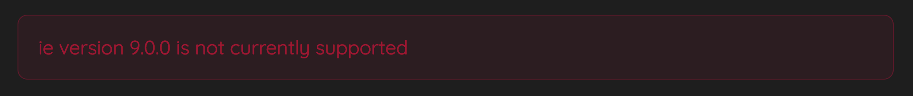
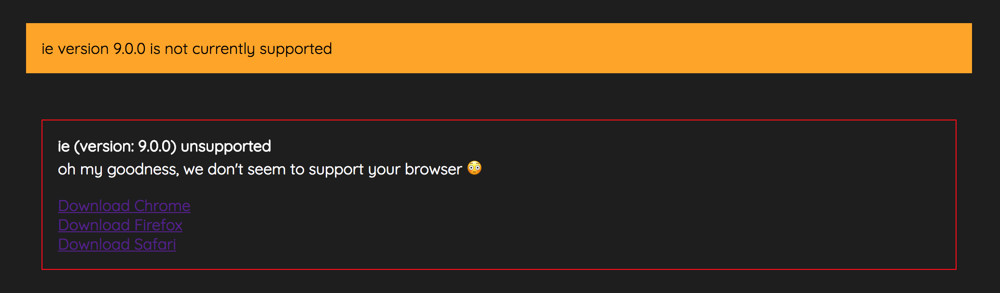

# react-browser-support

This component displays a message, if the current browser is not supported.
This is determined using a list of supportedBrowsers ( a javascript object).
Supported Browsers are specified as an Object to the `list` prop of `<BrowserDetector supported={minBrowserVersions}>`.

### Installation

`npm install react-browser-support --save-dev`

### Basic

You can use the default `BrowserDetector` component.
```jsx
import React from 'react'
import BrowserSupport, { detectBrowser } from 'react-browser-support'

const minBrowserVersions = {
    chrome: '4.10',
    edge: '6',
    firefox: '19.5',
    ie: '10',
    opera: '10.0',
    safari: '10.2',
}
export default class MyComponent extends React.Component {
    componentDidMount() {
        this.setState({ browser: detectBrowser() })
    }
    render() {
        return (
            //...
            <BrowserSupport supported={minBrowserVersions}/>
            //...
        )
    }
}
```



### Custom

You can apply your own `style`, `className` & `children` as props to the component, and it will use those in place of the defaults.

You can also extract the name & version of the current browser, using the function `onCheck`.

```jsx
componentDidMount() {
    this.onCheck = this.onCheck.bind(this);
    this.setState({ browser: detectBrowser() })
}
onCheck(browser) {
    this.setState({browser})
}
render() {
    return this.state ? (
        <div>
        {/* With Custom Content */}
        <BrowserSupport
            onCheck={this.onCheck}
            supported={minBrowserVersions}
            className='custom-warning-style'
        />

        {/* With Custom Content & Browser Version, etc. */}
        <BrowserSupport
            onCheck={this.onCheck}
            supported={minBrowserVersions}
            style={inlineWarningStyle}>
            <b>
                {this.state.browser.name} (version: {this.state.browser.version}) unsupported
            </b> 
            <div>
                oh my goodness, we don't seem to support your browser 😳
            </div>
            <div style={{display: 'flex', flexDirection: 'column', marginTop: '1em'}}>
                <a href='https://www.google.com/chrome/browser/desktop/index.html'>Download Chrome</a>
                <a href='https://www.mozilla.org/en-US/firefox/new/'>Download Firefox</a>
                <a href='https://safari.en.softonic.com/mac/download'>Download Safari</a>
            </div>
        </BrowserSupport>
    </div>
    ) : null
}
```



> NOTE: If you are using chrome, you can test this with the [User-Agent Switcher for Chrome](https://chrome.google.com/webstore/search/user%20agent%20switcher) extension.

## Dependencies:
|package|description|
|:-|:-|
|[`detect-browser`](https://www.google.co.za/url?sa=t&rct=j&q=&esrc=s&source=web&cd=1&cad=rja&uact=8&ved=0ahUKEwj6xM7L6I3XAhWBb1AKHe_mAHoQFggkMAA&url=https%3A%2F%2Fwww.npmjs.com%2Fpackage%2Fdetect-browser&usg=AOvVaw3svy9CEI9Cz5N40aSLtbrf)|determines which browser & version is being used|
|[`semver-compare`](https://www.google.co.za/url?sa=t&rct=j&q=&esrc=s&source=web&cd=1&cad=rja&uact=8&ved=0ahUKEwif567E6I3XAhWGbVAKHT1gA-wQFggkMAA&url=https%3A%2F%2Fwww.npmjs.com%2Fpackage%2Fsemver-compare&usg=AOvVaw2-quscAnPpaFq3_cjvpJ-m)|compares strings of semantic version numbers|